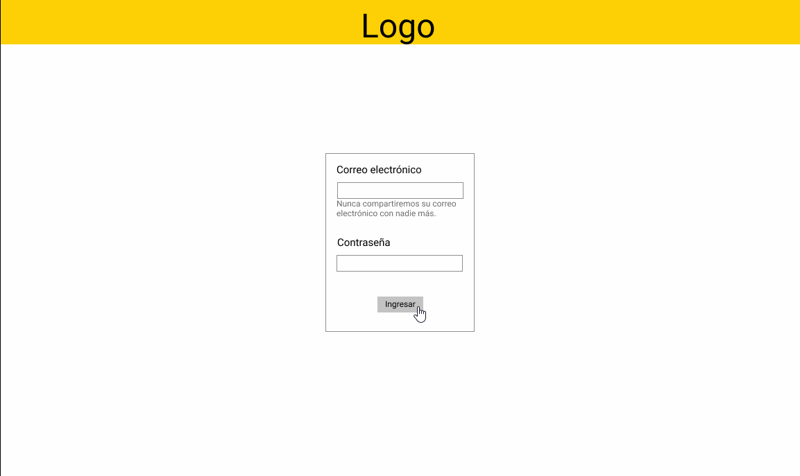
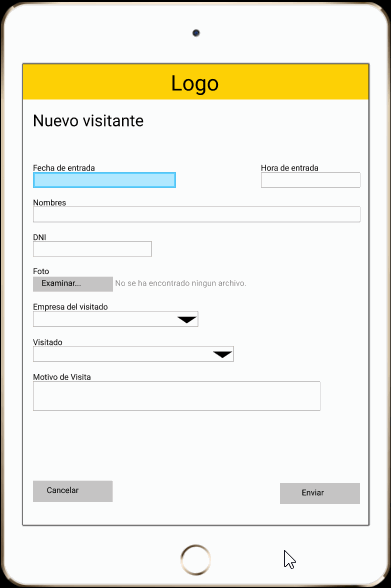

# Proyecto Final Common Core

## Preámbulo
El registro de visitantes en una empresa en América Latina es un proceso tedioso y manual. Lo común es que una persona esté en la recepción tomando nota - a veces con papel y lápiz - de cada visitante. Por razones de seguridad, usualmente piden a cada visitante dejar una identificación. Si vivimos en la era digital, ¿por qué seguimos registrando visitantes como si fuera 1985? ¿Qué tal si sustituimos a la persona en recepción por una tablet? ¿Qué tal si en lugar de pedir una identificación, tomamos una foto? 

## Introducción
En este proyecto la empresa de coworking donde opera Laboratoria en tu ciudad desea reinventar su proceso de registro de visitantes. 

## Entrevistas

Las entrevistas nos permitieron remodelar el flujo del proceso de registro de visitantes que al principio estabamos enfocados, en función a ello es se marcaron dos hitos importantes para el desarrollo del presente proyecto el primero antes de la entrevista y la segunda despues. El primero, ofrecia una solución tecnológica basado en un aplicativo en el que el usuario visitante tenia que registrar sus datos personales en el formulario de visitantes. El segundo, se determinó según a las entrevistas realizadas planteando una propuesta con enfoque al proceso de registro de visitantes que actualmente comunal maneja, donde el recepcionista es quien cumple el rol del registro del visitante.

 

A continuación explicamos a más detalle el proceso de desarrollo del presente proyecto teniendo dos etapas que determinaron nuestra propuesta tecnológica.

## Primera propuesta

Se planteó la siguiente propuesta teniendo como base inicial el preámbulo y el branchmarketing realizado, teniendo en referencia el servicio ofrece la empresa Evoy para el registro visitantes, donde el usuario principal es el visitante, ya que es quien asume el rol de completar los datos del formulario visitantes.

Se determinó los siguientes usuarios:

* Visitante 
* Visitado (Comunero)
* Administrador 

Se planteó el siguiente flujo:

El proceso inicia cuando el visitante registra sus datos personales, el dato del contacto y el motivo de la visita. Es sistema guarda la información del visitante y envía un correo electrónico al comunero informando acerca de la visita recibida. Por otro lado, permite al administrador visualizar todas las visitas realizadas indicando los datos del visitante, hora y fecha de entrada y de salida.

Se plantearon las siguientes historias de usuario como primera base de desarrollo:

### Historias de usuarios

  ### Usuario visitante
  * Yo como usuario visitante quiero poder registrarme para poder ingresar a la empresa.
  * Yo como usuario visitante quiero poder notificar a la persona que vengo a visitar para que sepa que he llegado.

  ### Usuario visitando / empleado
  * Yo como usuario visitado (empleado) quiero que me llegue una notificacion a mi correo para saber que mi visita ha llegado.

  ### Usuario administrador
  * Yo como usuario administrador quiero poder ver todas las visitas realizadas para llevar un control de las visitas.

## Segunda propuesta

En esta etapa se realizó las entrevistas a los usuarios. En base a las entrevistas realizadas, nos vimos en la necesidad de modificar la primera propuesta para cubrir las necesidades de los usuarios teniendo en cuenta el modelo que negocio que manejan.

Según al proceso que manejan

Se determinó a los siguientes usuarios:

* Recepionista
* Administrador 

Proceso actual comunal:

El proceso que actualmente gestionan comienza cuando la recepcionista pregunta al visitante los datos del comunero a quien esta buscando, verifica la información en la base de datos, una vez validado se comunica con el comunero informarndo acerca de su visita.

Proceso automatizado:

El proceso inicia cuando la recepionista registra los datos personales del visitante, los datos del contacto y el motivo de la visita. Es sistema guarda la información del visitante y envía un correo electrónico al comunero informando acerca de la visita recibida. Por otro lado, permite al administrador visualizar todas las visitas realizadas indicando los datos del visitante, hora y fecha de entrada y de salida.

Beneficios del desarrollo de un registro de visitantes virtual, según la perspectiva de los usuarios:

* Remarca el tema seguridad
* Acceso a informacion del visitante
* Acceso al historial de visitas realizadas
* Facilita la comunicación con el comunero

En base a la premisa se desglozan las siguientes historias de usuario.
  
### Historias de usuarios

  ### Usuario recepcionista
  * Yo como usuario recepcionista quiero poder registrar a los visitantes.
  * Yo como usuario recepcionista quiero poder notificar a la persona que vengo a visitar para que sepa que he llegado.

  ### Usuario visitando / empleado
  * Yo como usuario visitado (empleado) quiero que me llegue una notificacion a mi correo para saber que mi visita ha llegado.

  ### Usuario administrador
  * Yo como usuario administrador quiero poder ver todas las visitas realizadas para llevar un control de las visitas.

## Prototipo

El prototipo paso por un proceso de refactorización, este fue nuestra primera propuesta.

 
  

## Prototipo de alta fidelidad

Se rediseñó en base al feetback recibido de los entrevistados.

### Vista desktop / Usuario administrador
[Prototipo usuario administrador](https://www.figma.com/proto/Y8LWMEL5y8YhZfJMbNj8Yg1W/Untitled?node-id=49%3A6&scaling=min-zoom "desktop")

 

### Vista tablet / Usuario visitante
[Prototipo usuario vitante](https://www.figma.com/proto/Y8LWMEL5y8YhZfJMbNj8Yg1W/Untitled?node-id=49%3A1&scaling=scale-down "tablet")

 

 ### Test 

 

